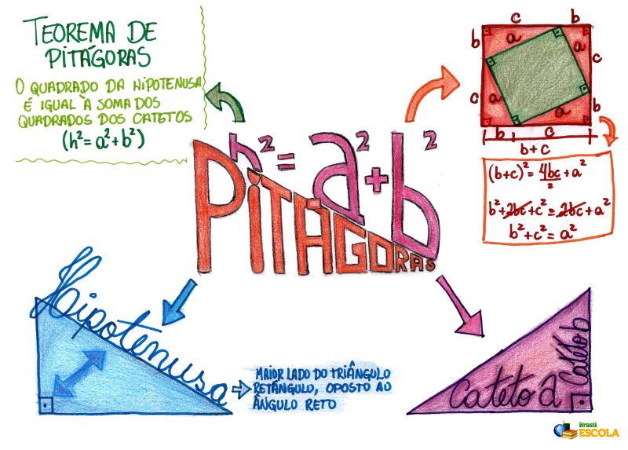
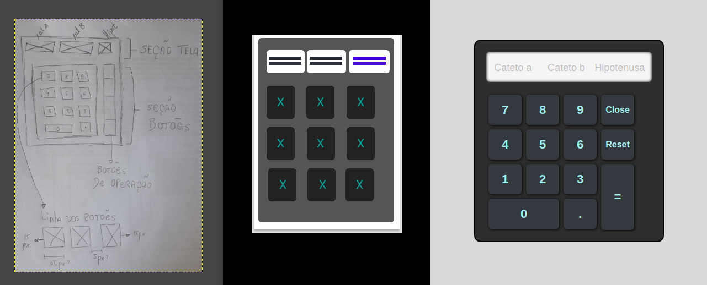

## Projeto Calculadora de Pitagóras (Viajante do Tempo)
 :pushpin:  Clique [aqui](https://nmonalisa.github.io/calculadora-de-Pitagoras/) para usar a calculadora de Pitagóras.

## Índice:
* [1. Contextualização](#1-contextualização)
* [2. Objetivo](#2-objetivo)
* [3. Interface e Experiência do Usuário](#3-UI-UX)
* [4. Árvore de diretórios e arquivos:](#4-árvore-de-diretórios-e-arquivos)
* [5. Outras informações:](#6-outras-informações)


## 1. Contextualização:
 Podemos estabelecer as relações entre os lados de um triângulo retângulo a partir do ___Teorema de Pitagorás___. [Pitágoras](https://pt.wikipedia.org/wiki/Pit%C3%A1goras) foi um filósofo, matemático, astrônomo e músico nascido em 570 a.c. na Grécia Antiga que fez importantes contribuições para o ramo da geometria. No teorema que leva seu nome, Pitagorás estabelece que existe uma relação matemática entre os lados (hipotenusa e catetos) de qualquer triângulo retângulo. A hipotenusa (h) é o lado oposto ao ângulo reto, sendo o maior lado do triângulo, e os catetos (a e b) são os outros dois lados que o formam. Dessa forma, Pitagóras demonstrou que a soma das áreas dos quadrados construídos sobre os catetos equivale à area do quadrado construído sobre a hipotenusa. A partir deste teorema, podmos derivar um enunciado que nos permite entender a ideia de forma mais simples: __em qualquer triângulo retângulo o comprimento da hipotenusa ao quadrado é igual a soma dos quadrados dos dois catetos__. Ou seja:<br>  __h² = a² + b²__<br><br>
Para ilustrar, veja abaixo um mapa mental que sintetiza essa ideia: <br>
<br>
__Fonte:__ Luis, R. [Brasil Escola](https://brasilescola.uol.com.br/matematica/teorema-pitagoras.htm).


## 2. Objetivo:
 O objetivo deste projeto é desenvolver uma aplicação web para calcular o comprimento da hipotenusa de um triângulo retângulo com base no Teorema de Pitagóras. Para isso o usuário deve informar as medidas dos dois catetos (a e b) e receber o retorno com a medida da hipotenusa, calculada com base na expressão matemática mostrada no tópico anterior. 

## 3. Interface e Experiência do Usuário (UI | UX): 
A interface da calculadora foi pensada para ser simples e objetiva, de forma a manter a atenção do usuário focada no seu objetivo principal: obter as medidas dos lados de um triângulo. A ideia é ter um plano de fundo neutro e sóbrio que deixe a calculadora em primeiro plano e simule da melhor forma possível a experiência de manipular uma calculadora física. Assim, o usuário pode se manter concentrado na tarefa de manipular a calculadora e os valores do triângulo, sem a necessidade de processar informações visuais adicionais. <br>
O layout da calculadora é composto por três seções principais: área de texto, botões numéricos e botões de configuração, descritas abaixo: <br>
* __1. Área de texto:__ composta por duas caixas que recebem as medidas dos catetos (a e b) do usuário (_inputs_). Para inserir valores em um desses campos é necessário clicar sobre ele e perceber o cursor piscando. Não há limites de números para cada medida, mas recomenda-se valores de até 7 digítos para uma melhor visualização das medidas e menor tempo de processamento da resposta. Uma terceira caixa de texto retorna o valor da hipotenusa (_output_) com precisão de duas casas decimais após a solicitação do resultado..<br>
* __2. Botões numéricos:__ composta por digítos de _0 a 9_ e marcador decimal _( . )_. O usuário pode inserir valores tanto pelos botões numéricos da calculadora (clicando sobre eles) quanto pelo uso das teclas do seu computador. <br>
* __3. Botões de configuração:__ o botão resultado _( = )_ retorna o valor da hipotenusa, o botão _reset_ limpa todos os campos e reinicia uma nova pesquisa, e o botão _close_ fecha a aplicação (exige duplo clique).<br><br>


Veja abaixo uma imagem com a evolução da interface durante a execução do projeto, com o protótipo de baixa fidelidade, o protótipo de média fidelidade e a interface final, respectivamente.<br>
<br>


## 4. Árvore de diretórios e arquivos:
```
├── README.md
├── src
|   ├── index.html
│   ├── main.js
│   └── style.css
└── assets
    ├── mindmap.jpeg
    |__ prototypes.png
```
* README.md - apresentação e documentação do projeto.
* src/index.html - arquivo com a marcação HTML e link para os arquivos CSS e JavaScript.
* src/main.js: implementa a lógica de programação e a comunicação com o servidor usando Javascript.
* src/style.css: arquivo com a estilização dos elementos HTML.
* assets/mindmap.jpeg: imagem do mapa mental do Teorema de Pitagórias.
* assets/prototypes.png: imagem contendo a evolução da interface do usuário ao longo do projeto.

## 5. Outras informações:
* Projeto desenvolvido com JavaScript puro (sem utilização de frameworks).<br>
* Autora: Nathalia Monalisa Francisco (nathaliamonalisa@gmail.com).
